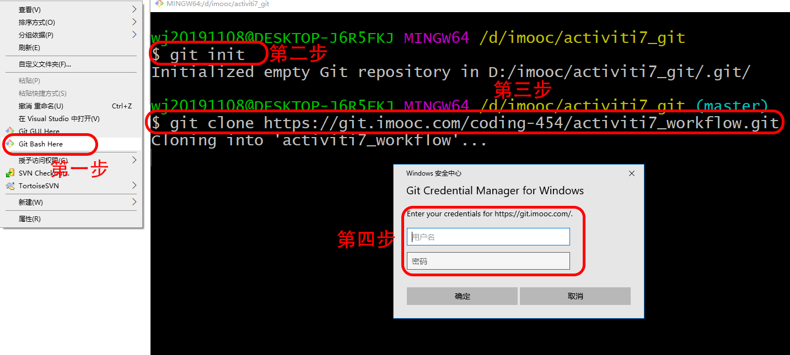
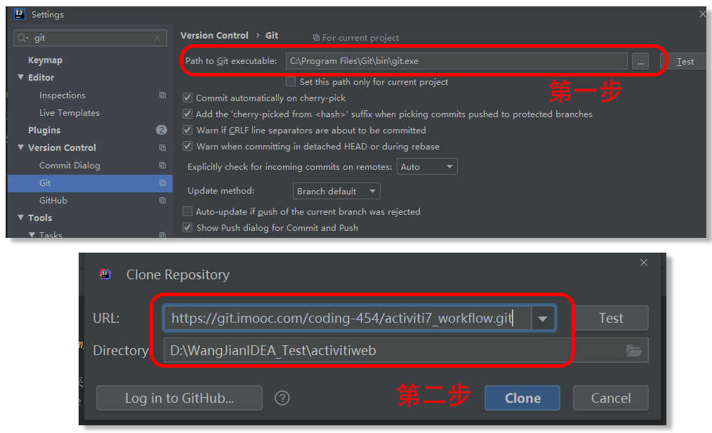
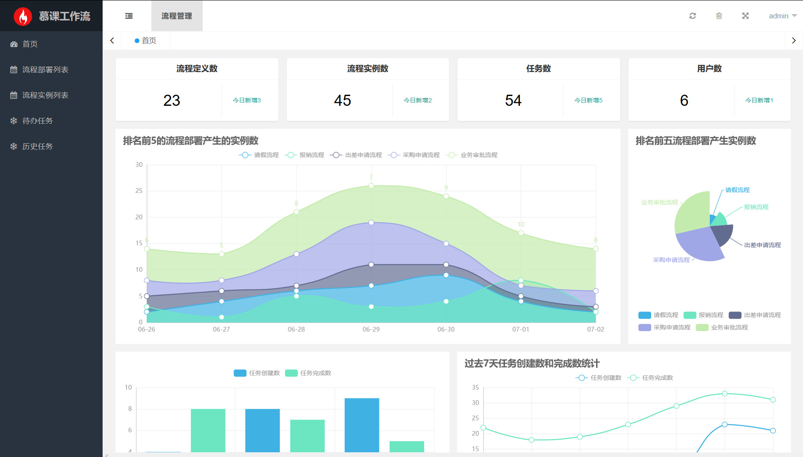
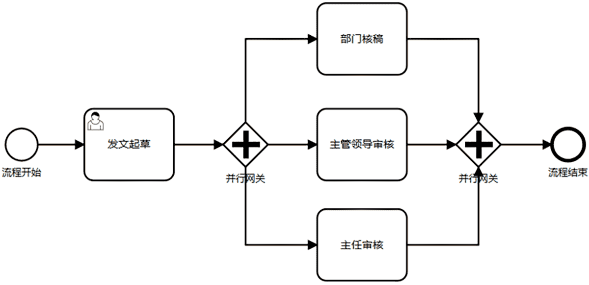

Acticiti7工作流引擎
===============
# 项目介绍
[查看本课程配套视频教程请，点这里](https://coding.imooc.com/class/454.html)

基于[Acticiti7](https://github.com/Activiti/Activiti)的Web工作流引擎，完整开源。

前端基于layuimini，[在github找到项目相关介绍](https://github.com/zhongshaofa/layuimini/releases)。

# 主要特性
* 完整的流程部署、创建实例、任务流转
* 使用Acticiti7新版特性
* 融合BPMN-JS作为流程绘制工具
* 整合SpringSecurity安全框架
 
# 启动项目流程

### 1、windows平台获取项目
 > 方案一：（使用GIT命令）

 * [下载GIT](https://git-scm.com/downloads)并安装
 * 新建本地文件夹
 * 选中文件夹右键，输入命令，文件夹变成Git仓库 `git init`
 * 复制git项目地址 `git clone https://github.com/wwdui/activiti7-workflow.git`
 * 输入默课网账号密码即可下载



 > 方案二：（使用IDEA）

 * [下载GIT](https://git-scm.com/downloads)并安装
 * 打开IDEA，【File】->【Settings】->【Version Control】->【Path to Git executable】设置为安装后的git.exe路径
 * 创建IDEA项目，【File】->【New】->【Project from Version Control】->【Git】设置URL`https://github.com/wwdui/activiti7-workflow.git`
 


### 2、修改本地Maven为阿里云
 * 打开IDEA，【File】->【Open】找到下载的项目中pom.xml，选择【Open as Project】
 * 【File】->【Settings】->【Build,Execution,Deploymen】->【Maven】，右侧User sttings file查看“settings.xml”位置
 * 打开settings.xml，找到`<mirrors>`标签，添加下面语句：
 
 ```
 <mirror>
     <id>aliyunmaven</id>
     <mirrorOf>*</mirrorOf>
     <name>阿里maven仓库</name>
     <url>https://maven.aliyun.com/repository/public</url>
 </mirror>
 ```
 * 保存后重新打开settings.xml确定保存成功

### 3、修改YML配置文件数据库连接
> 没有安装过数据库的同学也不要紧张，下一章课程会带领大家安装与配置数据库

 * 打开项目文件src\main\resources\application.yml
 * datasource节点配置username、password、url为自己的数据库配置信息，本项目默认使用MySQL数据库

### 4、执行user.sql创建用户表并修复Activiti7官方Bug
 * 注意：先运行一次项目，Activiti会自动初始化数据库需要的表，然后再执行下面的sql
 * 使用Navicat等工具执行项目根目录下user.sql


### 5、运行项目
>
     测试账号：bajie
     密码：1
     测试账号：wukong
     密码：1

* 点击IDEA右上方绿色箭头Run项目（或按Shift+F10运行项目）
* 打开浏览器输入地址localhost:8080/layuimini/page/login-1.html

# 效果预览
> 总体预览





# 使用说明

文档地址：[查看文档待更新](https://coding.imooc.com/class/454.html)


